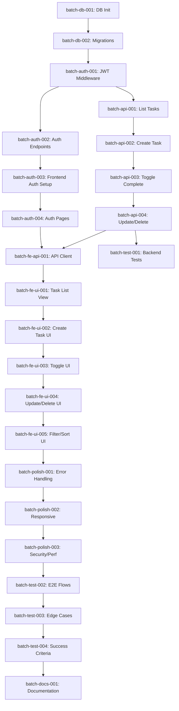

# Implementation Plan: Full-Stack Web TODO Application

**Branch**: `002-fullstack-web-app` | **Date**: 2025-12-06 | **Spec**: [spec.md](./spec.md)
**Input**: Feature specification from `specs/phases/phase2-web/spec.md`

## Summary

Transform the Phase I in-memory console TODO application into a full-stack, multi-user web application with persistent storage, JWT authentication, and responsive web UI.

**Primary Requirement**: Enable multiple users to securely manage their personal TODO lists through a web interface with complete data isolation between users.

**Technical Approach**:
- **Backend-First Strategy**: Build and validate FastAPI + PostgreSQL + JWT auth before frontend development
- **Vertical Slicing**: Implement each user story (P1-P4) completely (backend + frontend) before moving to next priority
- **Multi-User Isolation**: Enforce user_id verification at both database and API layers
- **JWT Security**: Better Auth integration with token validation on all protected endpoints

## Technical Context

**Language/Version**:
- Backend: Python 3.13+
- Frontend: TypeScript 5+ with Next.js 16+

**Primary Dependencies**:
- **Backend**: FastAPI (0.104+), SQLModel (0.0.14+), Uvicorn, Pydantic v2, Passlib (bcrypt), Python-JOSE (JWT), Alembic (migrations), psycopg2-binary
- **Frontend**: Next.js 16+ (App Router), React 18+, TypeScript, Tailwind CSS, Shadcn/UI, @tanstack/react-query, Axios, Better Auth client
- **Authentication**: Better Auth (issuing JWT tokens), shared secret for backend validation

**Storage**:
- Neon Serverless PostgreSQL
- SQLModel ORM with declarative models
- Alembic for schema migrations
- Indexes on tasks.user_id and tasks.completed

**Testing**:
- **Backend**: pytest for unit and integration tests, pytest-asyncio for async endpoints, httpx for API testing
- **Frontend**: Manual testing for Phase II (automated testing deferred to future phase)
- **Integration**: End-to-end user flow validation across all 7 user stories

**Target Platform**:
- **Backend**: ASGI server (Uvicorn) on Linux/Windows, deployable to Render/Railway/Fly.io
- **Frontend**: Next.js SSR/SSG, deployable to Vercel
- **Database**: Neon Serverless PostgreSQL (cloud-hosted)
- **Development**: Cross-platform (Windows/Mac/Linux localhost)

**Project Type**: Web application (frontend + backend)

**Performance Goals**:
- Task creation: <3 seconds end-to-end (SC-002)
- Task list load: <2 seconds for 100 tasks (SC-003)
- API response time: <500ms p95 under normal load (SC-010)
- Form validation feedback: <500ms (SC-009)
- User registration flow: <1 minute total (SC-001)

**Constraints**:
- Complete data isolation between users (zero cross-user data leakage - SC-004)
- JWT required on all task endpoints (FR-005)
- User_id from JWT must match user_id in URL path (FR-007, FR-009)
- Responsive design: 375px (mobile) to 1920px (desktop) - FR-037, SC-007
- Character limits: title 200 chars, description 2000 chars (FR-022)
- Session persistence across page refreshes (FR-010, SC-008)

**Scale/Scope**:
- Target: 100 concurrent users (SC-005)
- Tasks per user: Tested up to 100 tasks
- 7 user stories (P1-P4 priorities)
- 50 functional requirements across 6 categories
- 10 measurable success criteria
- 101 implementation tasks across 19 phases

## Constitution Check

*GATE: Must pass before Phase 0 research. Re-check after Phase 1 design.*

### Phase Verification

✅ **Current Phase**: Phase II (Modular Monolith)
✅ **Phase I Complete**: Console CRUD application fully functional, all acceptance criteria met
✅ **Phase Transition Authorized**: Moving from Phase I (CLI) to Phase II (Web App) per evolutionary roadmap

### Technology Stack Compliance

**Phase II Approved Technologies** (Constitution § III):
- ✅ Next.js frontend
- ✅ FastAPI backend
- ✅ Neon (PostgreSQL) database
- ✅ Better Auth for authentication (JWT tokens)

**Prohibited Technologies** (Not Yet in Scope):
- ❌ Phase III: AI Agents, MCP integration (deferred)
- ❌ Phase IV: Kubernetes, Helm charts (deferred)
- ❌ Phase V: Kafka, Dapr, event sourcing (deferred)

**Dependency Governance** (Constitution § III):
All external dependencies explicitly required for Phase II stack:
- SQLModel: PostgreSQL ORM (replaces Phase I in-memory storage)
- Better Auth: JWT authentication (multi-user requirement)
- Shadcn/UI: UI component library (responsive web requirement)
- React Query: Data fetching/caching (performance requirement)

**Verification**: ✅ PASS - All dependencies are Phase II approved

### Architecture Constraints

**Modular Monolith Requirements** (Constitution Phase II Roadmap):
- ✅ Separate frontend/backend with clear module boundaries
- ✅ Backend modules: models/, routers/, auth/, schemas/, database.py, config.py
- ✅ Frontend modules: app/ (pages), components/, lib/ (API client, auth)
- ✅ Clear API contracts between frontend and backend (REST endpoints)

**No Premature Microservices** (Constitution § IV):
- ✅ Backend is single FastAPI application (not multiple services)
- ✅ Database is single Neon instance (not database-per-service)
- ✅ No service mesh, API gateway, or service discovery (Phase IV concerns)

**Verification**: ✅ PASS - Architecture aligns with Phase II modular monolith pattern

### Migration Path Validation

**From Phase I** (Constitution Phase II Roadmap):
- ✅ Migration strategy documented: Extract TaskManager logic → FastAPI endpoints
- ✅ Data migration: In-memory dict → Neon PostgreSQL tables
- ✅ Interface migration: CLI menu → Next.js web UI consuming REST API
- ✅ Core CRUD operations preserved (create, read, update, delete, toggle complete)
- ✅ User stories map to Phase I features + new multi-user auth

**Backward Compatibility** (Constitution § Phase Transition):
- ⚠️ Phase I CLI will be superseded (not maintained in parallel)
- ✅ Core task functionality remains (CRUD operations preserved)
- ✅ No data loss: Phase I was ephemeral (in-memory only)
- ✅ User-facing features remain: all Phase I operations available in Phase II UI

**Verification**: ✅ PASS - Migration path clear, no breaking changes to core functionality

### Spec-First Development Compliance

**Specification Requirements** (Constitution § I):
- ✅ spec.md exists and approved (specs/phases/phase2-web/spec.md)
- ✅ 7 user stories with clear priorities (P1-P4)
- ✅ 50 functional requirements with testable acceptance criteria
- ✅ 10 measurable success criteria (technology-agnostic)
- ✅ No [NEEDS CLARIFICATION] markers (all requirements clear)
- ✅ Edge cases identified and documented
- ✅ Out of scope explicitly defined

**Verification**: ✅ PASS - Specification complete and requirements-driven

### Development Workflow Compliance

**Phase II Workflow** (Constitution § Development Workflow):
1. ✅ Specification complete (`/sp.specify` executed)
2. 🔄 Planning in progress (`/sp.plan` executing - this document)
3. ⏳ Task generation complete (`/sp.tasks` executed - 101 tasks created)
4. ⏳ Implementation pending (`/sp.implement` - blocked on plan completion)
5. ⏳ Validation pending (Phase 18 integration testing)

**Verification**: ✅ PASS - Following prescribed workflow

### Gates Summary

| Gate | Status | Requirement | Verification |
|------|--------|-------------|--------------|
| Phase Transition | ✅ PASS | Phase I complete, Phase II authorized | Console app functional, roadmap approved |
| Technology Stack | ✅ PASS | Only Phase II approved tech | No Phase III/IV/V dependencies |
| Architecture Pattern | ✅ PASS | Modular monolith, not microservices | Clear frontend/backend modules |
| Migration Strategy | ✅ PASS | Path from Phase I documented | TaskManager → FastAPI, CLI → Web UI |
| Spec-First | ✅ PASS | Complete spec before planning | spec.md approved, no NEEDS CLARIFICATION |
| Workflow | ✅ PASS | Following spec → plan → tasks → implement | Correct command sequence |

**OVERALL GATE STATUS**: ✅ **PASS** - Proceed to Phase 0 Research

**No Complexity Violations**: This plan adheres to all Phase II constraints without requiring complexity justifications.

## Project Structure

### Documentation (this feature)

```text
specs/phases/phase2-web/
├── spec.md              # Feature specification (/sp.specify output)
├── plan.md              # This file (/sp.plan output)
├── research.md          # Phase 0 technology research (generated below)
├── data-model.md        # Phase 1 database schema (generated below)
├── quickstart.md        # Phase 1 developer setup guide (generated below)
├── contracts/           # Phase 1 API contracts (generated below)
│   └── openapi.yaml     # OpenAPI 3.0 specification
├── tasks.md             # Implementation tasks (/sp.tasks output - already exists)
└── checklists/
    └── requirements.md  # Quality validation checklist
```

### Source Code (repository root)

```text
# Phase II: Web Application Structure

backend/
├── app/
│   ├── __init__.py
│   ├── main.py              # FastAPI app initialization, CORS, router registration
│   ├── config.py            # Environment variables (DATABASE_URL, BETTER_AUTH_SECRET)
│   ├── database.py          # SQLModel engine, session factory, get_session() dependency
│   ├── models/
│   │   ├── __init__.py
│   │   ├── user.py          # User SQLModel (id, email, name, created_at)
│   │   └── task.py          # Task SQLModel (id, user_id FK, title, description, completed, timestamps)
│   ├── schemas/
│   │   ├── __init__.py
│   │   ├── user.py          # UserCreate, UserResponse Pydantic schemas
│   │   └── task.py          # TaskCreate, TaskUpdate, TaskResponse Pydantic schemas
│   ├── routers/
│   │   ├── __init__.py
│   │   ├── auth.py          # POST /api/signup, POST /api/login
│   │   └── tasks.py         # Task CRUD endpoints (GET/POST/PUT/PATCH/DELETE)
│   └── auth/
│       ├── __init__.py
│       ├── utils.py         # verify_jwt_token(token) -> payload
│       ├── dependencies.py  # get_current_user() FastAPI dependency
│       └── password.py      # hash_password(), verify_password() with bcrypt
├── alembic/
│   ├── env.py               # Alembic configuration for SQLModel
│   └── versions/
│       └── 001_initial_schema.py  # Users + Tasks tables with indexes
├── requirements.txt         # Backend dependencies
├── .env.example             # Environment variable template
└── README.md                # Backend setup and API documentation

frontend/
├── app/
│   ├── layout.tsx           # Root layout with AuthProvider
│   ├── page.tsx             # Landing page (redirect to /login or /dashboard)
│   ├── login/
│   │   └── page.tsx         # Login form with Better Auth
│   ├── signup/
│   │   └── page.tsx         # Registration form
│   ├── dashboard/
│   │   ├── layout.tsx       # Dashboard layout with header + logout
│   │   └── page.tsx         # Task list page with filters/sorts
│   └── api/
│       └── auth/
│           └── [...all]/route.ts  # Better Auth API routes
├── components/
│   ├── ui/                  # Shadcn/UI components (button, input, dialog, etc.)
│   ├── providers/
│   │   ├── auth-provider.tsx      # AuthContext (user, logout)
│   │   └── toast-provider.tsx     # Global toast notifications
│   ├── tasks/
│   │   ├── task-list.tsx          # Task list rendering
│   │   ├── task-item.tsx          # Single task card (checkbox, edit, delete)
│   │   ├── task-filters.tsx       # Filter (all/complete/incomplete) + sort
│   │   ├── create-task-dialog.tsx # Create task form dialog
│   │   └── edit-task-dialog.tsx   # Edit task form dialog
│   ├── logout-button.tsx    # Logout button component
│   └── error-boundary.tsx   # React error boundary
├── lib/
│   ├── api-client.ts        # Axios instance with JWT interceptor
│   ├── auth.ts              # Better Auth configuration
│   └── api/
│       └── tasks.ts         # Task API functions (getTasks, createTask, etc.)
├── package.json             # Frontend dependencies
├── .env.local               # NEXT_PUBLIC_API_URL
├── tailwind.config.ts       # Tailwind configuration
├── components.json          # Shadcn/UI configuration
└── README.md                # Frontend setup instructions

database/
└── .env.example             # DATABASE_URL template for Neon connection

docs/
├── SETUP.md                 # Environment setup guide (prerequisites, Neon, env vars)
└── DEPLOYMENT.md            # Production deployment guide (Vercel, Render, CORS config)

.gitignore                   # Python, Node.js, env files
README.md                    # Root project documentation with architecture overview
```

**Structure Decision**:

This implements the **Option 2: Web application** pattern from the template, which is explicitly recommended when "frontend" and "backend" are detected (Constitution Phase II Roadmap).

**Module Boundaries**:
- **backend/**: FastAPI application (Python)
  - `app/models/`: Database layer (SQLModel entities)
  - `app/routers/`: API layer (HTTP endpoints)
  - `app/schemas/`: Contract layer (Pydantic request/response models)
  - `app/auth/`: Security layer (JWT validation, password hashing)
  - `alembic/`: Database migrations

- **frontend/**: Next.js application (TypeScript + React)
  - `app/`: Pages and routing (Next.js 16+ App Router)
  - `components/`: Reusable UI components (presentation layer)
  - `lib/`: Business logic (API client, auth config)

**Dependency Flow**: Frontend → API Client → Backend Endpoints → Database Models → Neon PostgreSQL

**Testability**: Each module can be tested independently (unit tests for models/utils, integration tests for routers, manual UI testing)

## Complexity Tracking

> **Fill ONLY if Constitution Check has violations that must be justified**

**No violations detected** - All Phase II constraints satisfied. No complexity justifications required.

## Phase 0: Research & Technology Validation

### Objectives

1. Validate Neon PostgreSQL setup and connection from Python
2. Research Better Auth JWT integration patterns for FastAPI
3. Investigate Next.js 16+ App Router authentication patterns
4. Determine best practices for SQLModel migrations with Alembic
5. Research Shadcn/UI integration with Next.js + Tailwind CSS

### Research Tasks

| Task | Question | Output Location |
|------|----------|-----------------|
| **R001** | How to connect FastAPI to Neon PostgreSQL using SQLModel? | research.md § Neon Integration |
| **R002** | What is the correct pattern for JWT validation in FastAPI middleware using Better Auth tokens? | research.md § JWT Authentication |
| **R003** | How to configure Alembic for SQLModel declarative models? | research.md § Database Migrations |
| **R004** | What is the recommended Next.js 16+ App Router pattern for client-side auth with Better Auth? | research.md § Frontend Auth |
| **R005** | How to set up Shadcn/UI with Next.js and configure Tailwind CSS? | research.md § UI Framework |
| **R006** | What is the best practice for multi-user data isolation in SQLModel queries? | research.md § Data Isolation |
| **R007** | How to implement optimistic UI updates in React with React Query? | research.md § Frontend Performance |

### Research Execution Strategy

For each research task:
1. **Search**: Use WebSearch for latest 2025 documentation and best practices
2. **Validate**: Cross-reference official documentation (FastAPI, Next.js, SQLModel, Better Auth)
3. **Document**: Record decision, rationale, alternatives considered, and code examples
4. **Extract**: Identify concrete implementation patterns for data-model.md and contracts/

**Output**: `research.md` with all NEEDS CLARIFICATION resolved and implementation patterns documented.

**Time Estimate**: 30-45 minutes for web research and consolidation.

## Phase 1: Design & Contracts

### Prerequisites

✅ `research.md` complete with all technology patterns validated

### 1.1 Data Model Design

**Objective**: Define SQLModel entities with complete schemas, relationships, and constraints.

**Entities** (from spec.md § Key Entities):

1. **User**
   - Fields: id (UUID, PK), email (str, unique), name (str), created_at (datetime)
   - Validation: Email format regex, name non-empty
   - Indexes: Unique constraint on email

2. **Task**
   - Fields: id (int, PK, auto-increment), user_id (str, FK → User.id), title (str, max 200), description (str nullable, max 2000), completed (bool, default False), created_at (datetime), updated_at (datetime)
   - Validation: Title non-empty, character limits enforced
   - Indexes: user_id (query performance), completed (filter performance)
   - Relationships: Foreign key to User with cascade delete

**Output**: `data-model.md` with:
- Entity relationship diagram (Mermaid syntax)
- Field definitions with types and constraints
- Index definitions with performance rationale
- SQLModel code examples for each entity
- Migration strategy (Alembic autogenerate)

### 1.2 API Contract Design

**Objective**: Define REST API endpoints with complete request/response schemas.

**Endpoint Groups** (from spec.md § API Endpoints):

1. **Authentication** (No JWT required)
   - POST /api/signup → UserCreate → UserResponse (201) | error (400)
   - POST /api/login → {email, password} → {access_token, token_type, user} (200) | error (401)

2. **Task Management** (JWT required, user_id verification)
   - GET /api/{user_id}/tasks → TaskResponse[] (200) | 401 | 403
   - POST /api/{user_id}/tasks → TaskCreate → TaskResponse (201) | 400 | 401 | 403
   - GET /api/{user_id}/tasks/{id} → TaskResponse (200) | 404 | 401 | 403
   - PUT /api/{user_id}/tasks/{id} → TaskUpdate → TaskResponse (200) | 400 | 404 | 401 | 403
   - PATCH /api/{user_id}/tasks/{id}/complete → TaskResponse (200) | 404 | 401 | 403
   - DELETE /api/{user_id}/tasks/{id} → 204 | 404 | 401 | 403

**Output**: `contracts/openapi.yaml` with:
- Complete OpenAPI 3.0 specification
- All endpoints documented
- Request/response schemas (Pydantic models)
- Authentication security scheme (Bearer JWT)
- Error response formats
- Example requests/responses

### 1.3 Quickstart Guide

**Objective**: Provide step-by-step developer setup instructions.

**Sections**:
1. Prerequisites (Python 3.13+, Node.js 18+, Neon account)
2. Neon PostgreSQL setup (create project, get connection string)
3. Backend setup (venv, install requirements, configure .env, run migrations, start Uvicorn)
4. Frontend setup (npm install, configure .env.local, run dev server)
5. Better Auth configuration (shared secret setup)
6. First request test (signup → login → create task → get tasks)
7. Troubleshooting common issues

**Output**: `quickstart.md` with executable commands and expected outputs

### 1.4 Agent Context Update

**Objective**: Update Claude Code agent context with Phase II technology stack.

**Action**: Run `.specify/scripts/powershell/update-agent-context.ps1 -AgentType claude`

**Expected Changes**:
- Add FastAPI, SQLModel, Neon, Next.js 16+, Better Auth to technology list
- Preserve manual additions between markers
- Update agent-specific context file

**Output**: Updated `.claude/context.md` (or equivalent agent context file)

## Phase 2: Implementation Batching Strategy

### Execution Strategy

**Backend-First Approach** (as specified in user input):
1. Complete all backend infrastructure and API endpoints
2. Validate backend with manual API tests (curl/Postman)
3. Build frontend consuming validated backend
4. Integration testing across full stack

**Strict Dependency Order**:
- Database → Auth Middleware → API Endpoints → Frontend → Integration

**Batch Size**: Small (S) - 30-60 minutes per batch, testable stable state at end of each

### Implementation Batches

#### **Group 1: Database Foundation** (Backend)

**batch-db-001**: Initialize Neon PostgreSQL & SQLModel Base
- **Tasks**: T006 (create Neon DB), T007 (env vars), T008-T009 (User model), T016-T020 (FastAPI setup, config, database.py)
- **Depends On**: []
- **Expected Output**: FastAPI app starts, database connection established, User model imports clean
- **Test Strategy**: Run health check endpoint, verify DB connectivity
- **Time**: ~30 min

**batch-db-002**: Create Task Model & Migrations
- **Tasks**: T010 (Task model), T011-T015 (Alembic setup, initial migration, apply)
- **Depends On**: [batch-db-001]
- **Expected Output**: Users and Tasks tables exist in Neon with indexes
- **Test Strategy**: Query Neon console, verify schema matches data-model.md
- **Time**: ~30 min

#### **Group 2: Authentication** (Backend → Frontend)

**batch-auth-001**: Backend JWT Middleware
- **Tasks**: T021-T024 (auth module, JWT verification, get_current_user dependency, password hashing)
- **Depends On**: [batch-db-002]
- **Expected Output**: JWT validation middleware functional, password hashing works
- **Test Strategy**: Manual test with mock JWT → verify 401 for invalid token
- **Time**: ~45 min

**batch-auth-002**: Auth Endpoints (Signup/Login)
- **Tasks**: T025-T027 (Pydantic schemas), T028-T031 (auth router, signup endpoint, login endpoint, mount router)
- **Depends On**: [batch-auth-001]
- **Expected Output**: POST /api/signup and POST /api/login endpoints working
- **Test Strategy**: curl signup → verify user in DB, curl login → verify JWT returned
- **Time**: ~45 min

**batch-auth-003**: Frontend Better Auth Setup
- **Tasks**: T039-T042 (Next.js init, Shadcn/UI, dependencies, env vars), T045-T046 (Better Auth config, API routes)
- **Depends On**: [batch-auth-002]
- **Expected Output**: Next.js dev server running, Better Auth configured
- **Test Strategy**: Frontend can reach backend /api/login endpoint
- **Time**: ~45 min

**batch-auth-004**: Frontend Auth Pages
- **Tasks**: T047-T051 (login page, signup page, AuthProvider, wrap layout, logout button)
- **Depends On**: [batch-auth-003]
- **Expected Output**: Users can signup, login, logout through web UI
- **Test Strategy**: Full auth flow in browser, verify JWT token stored, session persists on refresh
- **Time**: ~60 min

#### **Group 3: Backend Task API** (All P1-P4 endpoints)

**batch-api-001**: List Tasks Endpoint (US2 - P1)
- **Tasks**: T032-T033 (GET /api/{user_id}/tasks route, mount router)
- **Depends On**: [batch-auth-002]
- **Expected Output**: GET /tasks returns empty array for new user
- **Test Strategy**: curl with JWT → verify 200, verify user_id isolation (403 if mismatch)
- **Time**: ~30 min

**batch-api-002**: Create Task Endpoint (US3 - P2)
- **Tasks**: T034 (POST /api/{user_id}/tasks with validation)
- **Depends On**: [batch-api-001]
- **Expected Output**: POST /tasks creates task in DB, returns 201
- **Test Strategy**: curl create → verify task in DB, verify title validation (400 if empty)
- **Time**: ~20 min

**batch-api-003**: Toggle Complete Endpoint (US4 - P2)
- **Tasks**: T035 (PATCH /api/{user_id}/tasks/{id}/complete)
- **Depends On**: [batch-api-002]
- **Expected Output**: PATCH toggles task.completed boolean
- **Test Strategy**: curl toggle → verify DB updated, curl again → verify toggled back
- **Time**: ~20 min

**batch-api-004**: Update & Delete Endpoints (US5, US6 - P3)
- **Tasks**: T036-T037 (PUT /tasks/{id}, GET /tasks/{id}), T038 (DELETE /tasks/{id})
- **Depends On**: [batch-api-003]
- **Expected Output**: PUT updates task, DELETE removes task, GET retrieves single task
- **Test Strategy**: curl update → verify changes, curl delete → verify 404 on next GET
- **Time**: ~30 min

#### **Group 4: Frontend Task UI** (All P1-P4 components)

**batch-fe-api-001**: API Client & Type Definitions
- **Tasks**: T043-T044 (Axios client with JWT interceptor, task API functions)
- **Depends On**: [batch-api-004, batch-auth-004]
- **Expected Output**: API client auto-attaches JWT, handles 401 → redirect to login
- **Test Strategy**: Call getTasks() from browser console → verify request has Authorization header
- **Time**: ~30 min

**batch-fe-ui-001**: Task List View (US2 - P1)
- **Tasks**: T052-T055 (dashboard layout, task list page, task-list component, task-item component)
- **Depends On**: [batch-fe-api-001]
- **Expected Output**: Dashboard displays tasks from backend, loading skeleton shown while fetching
- **Test Strategy**: Login → see empty state, create task via API → refresh → see task
- **Time**: ~60 min

**batch-fe-ui-002**: Create Task UI (US3 - P2)
- **Tasks**: T056-T058 (install Shadcn components, create-task-dialog, add button to dashboard)
- **Depends On**: [batch-fe-ui-001]
- **Expected Output**: "Add Task" button opens dialog, form creates task, task appears in list
- **Test Strategy**: Click add → fill form → submit → verify task appears immediately (optimistic update)
- **Time**: ~45 min

**batch-fe-ui-003**: Toggle Complete UI (US4 - P2)
- **Tasks**: T059 (checkbox onClick handler with optimistic update)
- **Depends On**: [batch-fe-ui-002]
- **Expected Output**: Clicking checkbox toggles completion immediately
- **Test Strategy**: Click checkbox → verify visual change instant, refresh → verify persisted
- **Time**: ~20 min

**batch-fe-ui-004**: Update & Delete UI (US5, US6 - P3)
- **Tasks**: T060-T061 (edit-task-dialog, edit button), T062-T063 (delete confirmation, delete button)
- **Depends On**: [batch-fe-ui-003]
- **Expected Output**: Edit icon opens dialog with pre-filled data, delete requires confirmation
- **Test Strategy**: Edit task → save → verify changes, delete task → confirm → verify removed
- **Time**: ~45 min

**batch-fe-ui-005**: Filter & Sort UI (US7 - P4)
- **Tasks**: T064-T066 (task-filters component, sort dropdown, dynamic filtering)
- **Depends On**: [batch-fe-ui-004]
- **Expected Output**: Filter buttons show all/complete/incomplete, sort dropdown changes order
- **Test Strategy**: Apply "Incomplete only" → verify completed tasks hidden, sort oldest first → verify order
- **Time**: ~30 min

#### **Group 5: Cross-Cutting Concerns**

**batch-polish-001**: Error Handling & Loading States
- **Tasks**: T067-T069 (error boundary, toast system, skeleton loading)
- **Depends On**: [batch-fe-ui-005]
- **Expected Output**: Errors show as toasts, loading states smooth
- **Test Strategy**: Trigger API error → verify toast appears, slow network → verify skeleton
- **Time**: ~30 min

**batch-polish-002**: Responsive Design
- **Tasks**: T070-T072 (mobile 375px, tablet 768px, desktop 1920px testing)
- **Depends On**: [batch-polish-001]
- **Expected Output**: All pages functional at 375px, 768px, 1920px viewports
- **Test Strategy**: Browser DevTools responsive mode → test all breakpoints
- **Time**: ~45 min

**batch-polish-003**: Security & Performance
- **Tasks**: T073-T076 (input sanitization, CSRF protection, React Query caching, debouncing)
- **Depends On**: [batch-polish-002]
- **Expected Output**: XSS prevented, caching reduces API calls, validation debounced
- **Test Strategy**: Attempt XSS in task title → verify sanitized, check network tab for cache hits
- **Time**: ~30 min

#### **Group 6: Integration Testing**

**batch-test-001**: Backend API Tests
- **Tasks**: T099 (backend README with API docs), setup pytest infrastructure
- **Depends On**: [batch-api-004]
- **Expected Output**: pytest suite for all CRUD endpoints + auth
- **Test Strategy**: Run pytest → all tests pass (unit + integration)
- **Time**: ~60 min (deferred - manual testing sufficient for Phase II)

**batch-test-002**: End-to-End User Flows
- **Tasks**: T077-T083 (manual testing of all 7 user stories)
- **Depends On**: [batch-fe-ui-005]
- **Expected Output**: All acceptance scenarios validated
- **Test Strategy**: Execute each user story scenario from spec.md § User Scenarios & Testing
- **Time**: ~60 min

**batch-test-003**: Edge Case Validation
- **Tasks**: T084-T090 (JWT expiration, duplicate email, slow network, empty state, max length, backend down, SQL injection)
- **Depends On**: [batch-test-002]
- **Expected Output**: All edge cases handled gracefully
- **Test Strategy**: Simulate each edge case, verify error handling
- **Time**: ~45 min

**batch-test-004**: Success Criteria Validation
- **Tasks**: T091-T098 (validate SC-001 to SC-010)
- **Depends On**: [batch-test-003]
- **Expected Output**: All 10 success criteria met with measurements
- **Test Strategy**: Execute each success criterion test, record results
- **Time**: ~45 min

#### **Group 7: Documentation**

**batch-docs-001**: Final Documentation
- **Tasks**: T100-T101 (SETUP.md, DEPLOYMENT.md), update root README
- **Depends On**: [batch-test-004]
- **Expected Output**: Complete developer setup guide and deployment guide
- **Test Strategy**: Fresh developer follows SETUP.md → app runs successfully
- **Time**: ~30 min

### Batch Dependency Graph



**Critical Path**:
DB Init → Migrations → JWT Middleware → Auth Endpoints → Auth Pages → API Endpoints → API Client → Task UI → Polish → Testing → Docs

**Parallelization Opportunities**:
- Once batch-auth-002 complete: batch-auth-003 (frontend) and batch-api-001 (backend) can run in parallel
- Once batch-api-004 complete: batch-test-001 (backend tests) can run independently of frontend development

**Total Estimated Time**: ~12-16 hours of focused development across all batches

## Implementation Notes

### Multi-User Isolation Enforcement

**Database Layer**:
- Foreign key constraint: `tasks.user_id` → `users.id` (enforced at DB level)
- Index on `tasks.user_id` for query performance
- All task queries MUST filter by `user_id`

**API Layer**:
- JWT token contains `user_id` claim
- `get_current_user()` dependency extracts `user_id` from JWT
- All task endpoints verify: `current_user == path_user_id`
- HTTP 403 Forbidden if mismatch (FR-009)

**Frontend Layer**:
- API client auto-injects JWT from Better Auth session
- User ID managed by auth context (no manual URL construction)
- All task API calls use authenticated user's ID

**Testing Strategy**:
- Create User A and User B
- User A creates tasks
- Attempt to access User A's tasks as User B → verify 403
- Verify User B cannot see User A's tasks in list → verify isolation

### JWT Authentication Flow

1. **Signup**: POST /api/signup → User created in DB with hashed password
2. **Login**: POST /api/login → Backend verifies password → Better Auth issues JWT with `user_id` claim → JWT returned to frontend
3. **Storage**: Frontend stores JWT in Better Auth session (cookies/localStorage)
4. **Request**: Frontend API client attaches `Authorization: Bearer {JWT}` to all requests
5. **Validation**: Backend middleware extracts JWT → verifies signature with `BETTER_AUTH_SECRET` → extracts `user_id` → passes to endpoint
6. **Authorization**: Endpoint compares `user_id` from JWT with `user_id` in URL → 403 if mismatch
7. **Expiration**: JWT expires after configured time → Backend returns 401 → Frontend redirects to login

### Performance Optimizations

**Backend**:
- Database indexes on `tasks.user_id` and `tasks.completed` (FR-027, FR-028)
- SQLModel ORM with parameterized queries (prevents SQL injection, FR-049)
- Connection pooling via SQLModel engine

**Frontend**:
- React Query for data fetching with 5-minute cache (T075)
- Optimistic UI updates for mutations (T059, T063)
- Form validation debounced to 500ms (T076)
- Skeleton screens during loading (T069)
- Code splitting via Next.js App Router (automatic)

**Target Metrics**:
- API response time: <500ms p95 (SC-010)
- Task list load: <2 seconds for 100 tasks (SC-003)
- Task creation: <3 seconds end-to-end (SC-002)

### Security Measures

**Authentication**:
- Passwords hashed with bcrypt (FR-046)
- JWT signed with shared secret (BETTER_AUTH_SECRET)
- JWT validation on all protected endpoints (FR-005)

**Authorization**:
- User ID verification on every task operation (FR-007, FR-009)
- 403 Forbidden for cross-user access attempts

**Input Validation**:
- Pydantic schemas validate all API inputs
- Character limits enforced (title 200, description 2000 - FR-022)
- Email format validation (FR-002)
- Password requirements (8+ chars, uppercase, lowercase, number - FR-003)

**Output Sanitization**:
- Input sanitization to prevent XSS (FR-048, T073)
- Parameterized queries via SQLModel ORM (prevents SQL injection - FR-049)

**CORS Configuration**:
- Backend CORS allows only frontend origin (FR-047)
- Production: Explicit domain whitelist
- Development: localhost:3000 allowed

### Error Handling Strategy

**API Errors** (FR-044, FR-045):
- 200 OK: Successful GET/PUT/PATCH
- 201 Created: Successful POST
- 204 No Content: Successful DELETE
- 400 Bad Request: Validation errors (empty title, max length)
- 401 Unauthorized: Invalid/missing JWT
- 403 Forbidden: User ID mismatch
- 404 Not Found: Task does not exist
- 500 Internal Server Error: Unexpected errors

**Response Format** (FR-045):
```json
{
  "data": {...},      // Present on success
  "error": "...",     // Present on error
  "message": "..."    // User-friendly message
}
```

**Frontend Error Handling** (FR-036, T067-T068):
- Global error boundary for React errors
- Toast notifications for API errors
- Retry logic for failed requests
- User-friendly messages (no stack traces)

## Phase 2: Planning Completion

### Artifacts Generated

1. ✅ **plan.md** (this file): Complete implementation plan with batching strategy
2. ⏳ **research.md**: Technology research and validation (to be generated)
3. ⏳ **data-model.md**: Database schema with ERD and SQLModel examples (to be generated)
4. ⏳ **contracts/openapi.yaml**: Complete API specification (to be generated)
5. ⏳ **quickstart.md**: Developer setup guide (to be generated)

### Next Steps

1. **Execute Phase 0 Research**: Generate `research.md` by running web searches for each R001-R007 task
2. **Execute Phase 1 Design**: Generate `data-model.md`, `contracts/openapi.yaml`, and `quickstart.md`
3. **Update Agent Context**: Run update-agent-context script
4. **Re-Validate Constitution Check**: Ensure no new violations introduced during design
5. **Begin Implementation**: Execute `/sp.implement` with batching strategy from this plan

### Success Criteria for Planning Phase

- ✅ All Technical Context fields filled (no NEEDS CLARIFICATION remaining after research)
- ✅ Constitution Check passes all gates
- ✅ Project structure defined with exact file paths
- ✅ Implementation batches defined with clear dependencies
- ✅ Multi-user isolation strategy documented
- ✅ JWT authentication flow documented
- ✅ Error handling strategy defined
- ✅ Performance targets specified

**Planning Phase Status**: ✅ **COMPLETE** (pending research.md, data-model.md, contracts/, quickstart.md generation)

---

**Branch**: `002-fullstack-web-app`
**Spec**: [specs/phases/phase2-web/spec.md](./spec.md)
**Tasks**: [specs/phases/phase2-web/tasks.md](./tasks.md)
**Plan**: This document
**Date**: 2025-12-06
**Author**: Claude Sonnet 4.5 (via `/sp.plan` command)
